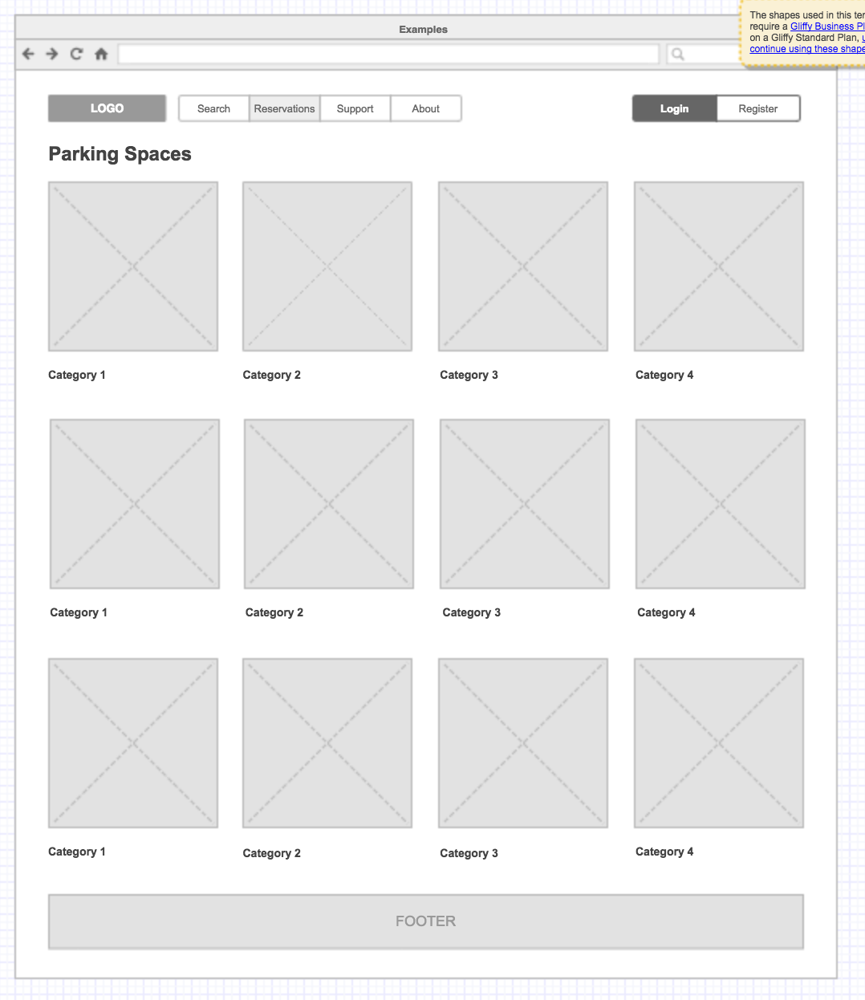
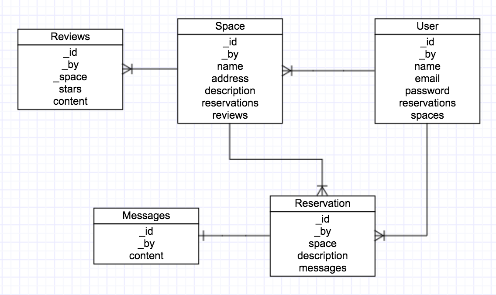

# SPOT

Finding parking spaces can be a pain. Studies suggest that up to 30% of downtown drivers may just be looking for a space to park, wasting an average of 3.3 minutes everyday. Ultimately, making traffic situation worse.

Most of us leave for work during the 9-5 window with our cars, leaving our own parking spaces at home empty. Why not have somebody rent it? Let's all buid a community that helps cut cost and improve traffic and parking situations around the city.

## Development

### Wireframe

### Entity Relationship Diagram

### Technologies Used
1. Node.js
2. Express.js
3. MongoDB
4. Angular.js

### User Stories
* I can login and logout
* I can register to create my own account
* I can list my parking space for people to see
* I can view listed parkig spaces
* I can send requests to use a parking space
* I can accept requests from other members to use my space
* I can send messages to members I requested a space from
* I can send messages to members who requested for my space

## Future Work
* I can leave reviews to spaces I have used
* I can block dates where my space is unavailable
* I can filter my search to available spaces on the desired dates

### How to run locally
1. Install Node.js

2. Clone the repo

3. Change your directory to spot

4. Install dependencies

        $ npm install

5. Spin uo your node server

        $ node server/server.js

6. Open your browser

### How to contribute

1. Fork it
2. Create your feature branch: git checkout -b new-feature
3. Commit your changes: git commit -m 'Some feature'
4. Push to your feature branch: git push origin new-feature
5. Submit a pull request